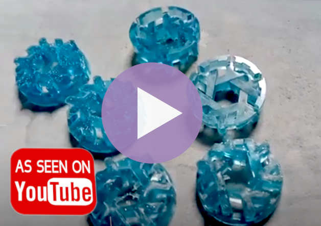

# nix-wheels
Cad files for the *nix wheel* a pointless stacking 3D thing

## Folder Structure
the orignal blender sources are in the *blender-sources* folder
print-ready STL files are in the *stl* folder

## Versions
 - Version-1 : A rolling logo
 - Version-2 : A rolling stackable logo
 	- Version-2-resin-stack : A block of logo's with supports for resin printing
